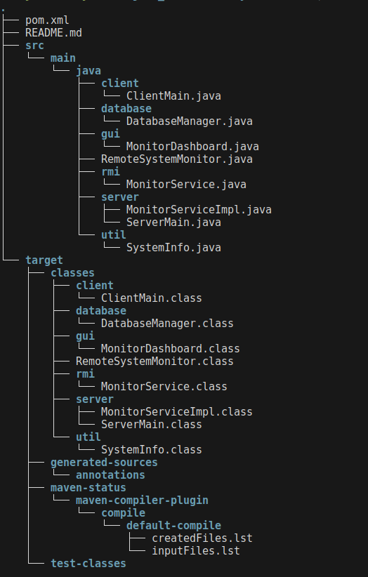

# RemoteSystemMonitor

A simple Java RMI-based remote system performance monitor. Clients collect local CPU, memory, and disk usage and send that data to an RMI server which stores it in a MySQL database and displays live updates in a Swing dashboard.

**Project Version:** 1.0-SNAPSHOT

**Java:** 21 (see `pom.xml`)

**Dependency:** MySQL Connector/J (declared in `pom.xml`).

**Quick Summary**

- **Server:** `server.ServerMain` — starts an RMI registry (port 1099), registers `MonitorService`, and opens the Swing `MonitorDashboard` to view connected machines and statistics.
- **Client:** `client.ClientMain` — prompts for a machine name, collects system metrics via `util.SystemInfo`, and sends them to the server every 5 seconds.
- **RMI Interface:** `rmi.MonitorService` — remote interface used by clients to submit stats.
- **Persistence:** `database.DatabaseManager` — saves received measurements into a MySQL table `system_stats`.

**Requirements**

- JDK 21
- Maven
- MySQL server (or compatible) running and accessible

**Database Setup**
Run these commands in MySQL (adjust user/credentials as needed):

```sql
CREATE DATABASE resource_monitor;
USE resource_monitor;

CREATE TABLE system_stats (
  id INT AUTO_INCREMENT PRIMARY KEY,
  machine_name VARCHAR(255) NOT NULL,
  cpu_usage DOUBLE,
  memory_usage DOUBLE,
  disk_usage DOUBLE,
  received_at TIMESTAMP DEFAULT CURRENT_TIMESTAMP
);
```

The project uses the JDBC URL, user, and password hardcoded in `database.DatabaseManager`:

- URL: `jdbc:mysql://localhost:3306/resource_monitor`
- USER: `root`
- PASSWORD: `` (empty string)

Update these values in `database/DatabaseManager.java` if your environment differs.

**Build**
From the project root:

```bash
mvn clean package
mvn dependency:copy-dependencies -DoutputDirectory=target/dependency
```

**Run**
Start the server (on the machine that will host the dashboard and database):

```bash
java -cp target/classes:target/dependency/* server.ServerMain
```

Start a client (can be run on other machines that can reach the server's RMI registry):

```bash
java -cp target/classes:target/dependency/* client.ClientMain
```

Notes:

- The server attempts to create an RMI registry on port `1099`. If one already exists, it will reuse it.
- The client looks up service named `MonitorService` on `localhost:1099` by default. Change the host in `ClientMain` if connecting remotely.

**Architecture & Packages**

- `server` — server entry point and `MonitorServiceImpl` (RMI service implementation).
- `client` — client entry point that collects and sends system stats.
- `rmi` — remote interface `MonitorService`.
- `gui` — Swing-based dashboard `MonitorDashboard` for live view.
- `database` — `DatabaseManager` with simple JDBC insert logic.
- `util` — `SystemInfo` helper using `OperatingSystemMXBean` to get metrics.

**Configuration**

- Database credentials: edit `database/DatabaseManager.java`.
- RMI host/port for clients: edit `client/ClientMain` lookup host/port.

**Troubleshooting**

- If the client shows "Cannot Connect To Server": ensure the server is running, the RMI registry is reachable on port 1099, and firewalls allow the connection.
- If DB inserts fail: confirm MySQL is running, credentials match, and the `resource_monitor.system_stats` table exists.
- `SystemInfo` uses `com.sun.management.OperatingSystemMXBean`. Some JVMs or permissions may limit the available metrics.

**Extending / Notes**

- Consider externalizing DB configuration (properties file or env vars) instead of hardcoding credentials.
- Add authentication or security to RMI if exposing across untrusted networks.

---

**Development Team**

| Name | ID |
| --- | --- |
| Solomon Kahsay | ETS1308/16 |
| Suheil Ali | ETS1315/16 |
| Tekleyesus Asteraw | ETS1336/16 |

---


**Project Structure**

---
